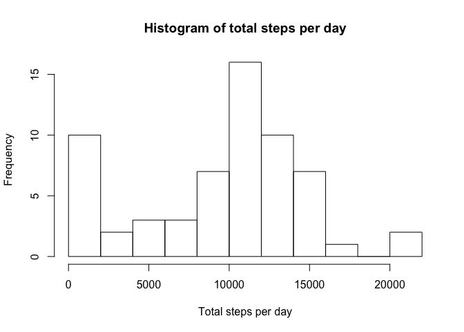
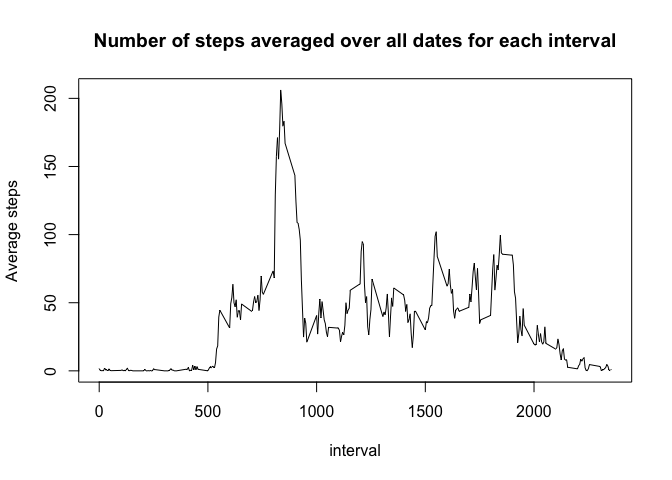
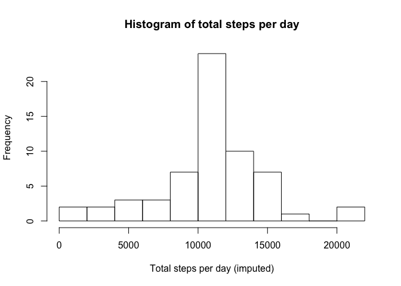

# Reproducible Research: Peer Assessment 1


## Loading and preprocessing the data

The following code was used to load and preprocess the data:


```r
zipfile<-"activity.zip"
csvfile<-"activity.csv"
if (!file.exists(csvfile)) {
    unzip(zipfile)    
    }
activity_data<-read.csv(csvfile)
```

## What is mean total number of steps taken per day?

The following code was used to plot a histogram of the total
steps per day and then calculate the mean and median of that data:


```r
library(dplyr)
# add up the total steps on each date
activity_total_steps<-activity_data%>%group_by(date)%>%
    summarize(total_steps=sum(steps,na.rm=TRUE))
# plot a histogram of total steps
hist(activity_total_steps$total_steps,breaks=10,
     xlab="Total steps per day",main="Histogram of total steps per day")
```

 

```r
# Calculate the mean
mean_steps_per_day<-mean(activity_total_steps$total_steps)
cat("The mean total number of steps per day is",mean_steps_per_day)
```

```
## The mean total number of steps per day is 9354.23
```

```r
# Calculate the median
median_steps_per_day<-median(activity_total_steps$total_steps)
cat("The median total number of steps per day is",median_steps_per_day)
```

```
## The median total number of steps per day is 10395
```

## What is the average daily activity pattern?

The following code calculates the average number of steps in each
interval, plots it and then identifies the interval with the
maximum value:


```r
# group activity data by interval and calculate average
activity_mean_interval<-activity_data%>%group_by(interval)%>%
    summarize(mean_steps=mean(steps,na.rm=TRUE))
# plot as a line graph
plot(activity_mean_interval,type="l",ylab="Average steps",
     main="Number of steps averaged over all dates for each interval")
```

 

```r
# identify index with maximum value
max_index<-order(activity_mean_interval$mean_steps,decreasing=TRUE)[1]
# identify interval corresponding to that index and print
max_interval<-as.numeric(activity_mean_interval[max_index,1])
cat("The interval with the maximum average number of steps is",max_interval)
```

```
## The interval with the maximum average number of steps is 835
```

## Imputing missing values

The strategy used to impute the missing values was to
replace them the average number of steps for that interval as calculated
in the previous code chunk. The following code counts the number of NAs,
replaces them with the average value for that interval, plots a histogram
of the adjusted data, calculates the mean and median and compares them to
the original values:


```r
# count the number of NAs
num_na<-sum(is.na(activity_data))
cat("The number of NAs in the data is",num_na)
```

```
## The number of NAs in the data is 2304
```

```r
# copy the activity data to a new table
activity_data_mod<-activity_data
# define a function to return the average number of steps for an interval
replace_with_mean<-function(interval) {
    as.numeric(activity_mean_interval[activity_mean_interval$interval==interval,2])
    }
# loop over the table
for (i in 1:nrow(activity_data_mod)) {
    # if the number of steps is NA then replace with average
    if (is.na(activity_data_mod[i,"steps"])) {
        activity_data_mod[i,"steps"]<-replace_with_mean(activity_data_mod[i,"interval"])
        }
    }

# add up the total steps on each date
activity_total_steps_mod<-activity_data_mod%>%group_by(date)%>%
    summarize(total_steps=sum(steps,na.rm=TRUE))
# plot a histogram of total steps
hist(activity_total_steps_mod$total_steps,breaks=10,
     xlab="Total steps per day (imputed)",
     main="Histogram of total steps per day")
```

 

```r
# Calculate the mean
mean_steps_per_day_mod<-mean(activity_total_steps_mod$total_steps)
cat("The mean total imputed number of steps per day is",mean_steps_per_day_mod)
```

```
## The mean total imputed number of steps per day is 10766.19
```

```r
difference<-mean_steps_per_day_mod-mean_steps_per_day
cat(sep="","The difference from the original value is ",
    difference," which is ",format(100*difference/mean_steps_per_day,digits=3),"%")
```

```
## The difference from the original value is 1411.959 which is 15.1%
```

```r
# Calculate the median
median_steps_per_day_mod<-median(activity_total_steps_mod$total_steps)
cat("The median total imputed number of steps per day is",
    median_steps_per_day_mod)
```

```
## The median total imputed number of steps per day is 10766.19
```

```r
difference<-median_steps_per_day_mod-median_steps_per_day
cat(sep="","The difference from the original value is ",
    difference," which is ",format(100*difference/median_steps_per_day,digits=3),"%")
```

```
## The difference from the original value is 371.1887 which is 3.57%
```

## Are there differences in activity patterns between weekdays and weekends?

The following code seperates the data by weekday or weekend, calculates
the average number of steps for each interval and type of day and
plots it using tha lattice package:


```r
# convert date field into POSIX date
activity_data$date<-strptime(activity_data$date,format="%Y-%m-%d")
# create temporary vector with days of the week
dotw<-weekdays(activity_data$date)
# create temporary vector which gives true/false if day is weekend
weekend<-dotw=="Saturday"|dotw=="Sunday"
# set default type of day in activity to be a weekday
activity_data$type_of_day<-"weekday"
# change the ones which are actually the weekend to the correct value
activity_data[weekend,"type_of_day"]<-"weekend"
# turn it into a factor
activity_data$type_of_day<-factor(activity_data$type_of_day)
# calculate the mean steps for each interval for at weekends and weekdays
activity_mean_interval_bytype<-activity_data%>%select(-date)%>%
    group_by(type_of_day,interval)%>%
    summarize(mean_steps=mean(steps,na.rm=TRUE))
library(lattice)
# Plot mean number of steps against interval for both types of day
xyplot(mean_steps ~ interval | type_of_day, data=activity_mean_interval_bytype,layout=c(1,2),type="l",ylab="Number of steps",xlab="Interval")
```

 
